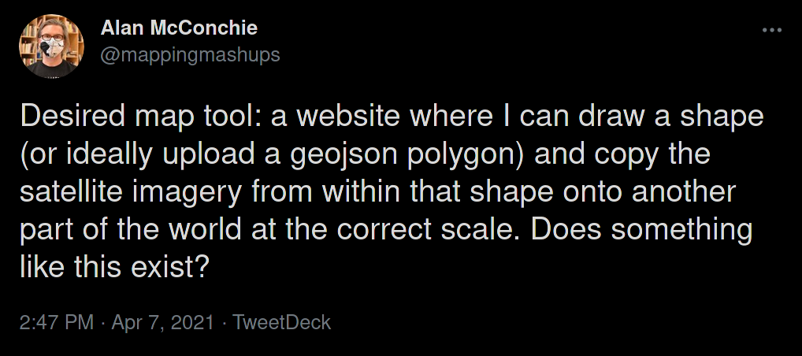

# mapclips

An experimental proof-of-concept for clipping Mapbox imagery using arbitrary shapes. Intended for size comparisons of various geospatial features at scale (e.g. the *Ever Given*).

## run

First, build the site.

```bash
make bundle
```

Then run a simple static server for the index.html file. I've been using [m3ng9i/ran](https://github.com/m3ng9i/ran) lately.
```
ran -p 8080
```

## status

For now, this demo uses a static GeoJSON polygon drawn around the US Pentagon. Clicking the camera icon in the Draw control bar will save a PNG image using the polygon to clip the satellite imagery.

To do:
* [ ] Change from a camera click to a copy/paste interaction
* [ ] Copy imagery clipped from a shape and then paste copies back on the map (at scale)
* [ ] Accept both drawn shapes or an uploaded GeoJSON shape

## inspiration

Originally inspired by [Ever Given Ever YWhere](https://evergiven-everywhere.glitch.me/) from [@en_dash](https://twitter.com/en_dash). An earlier demo can be found at [engelsjk/evergiven-and-other-things](https://github.com/engelsjk/evergiven-and-other-things). Further inspiration provided by [@mappingmashups](https://twitter.com/mappingmashups):


