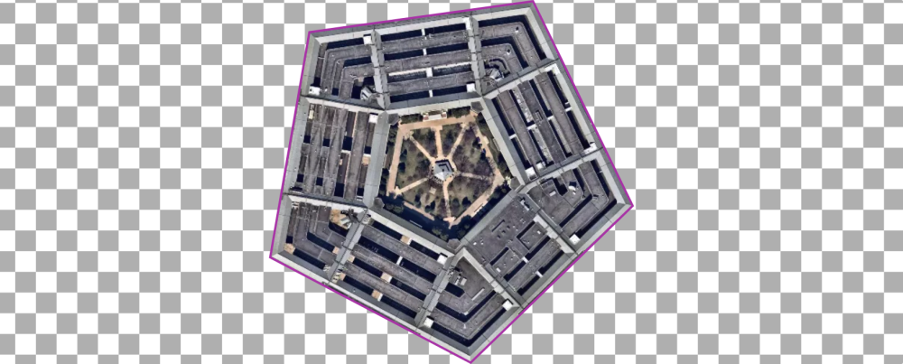

# mapclips

An experimental demonstration of clipping Mapbox imagery using arbitrary shapes. Intended for size comparisons of various geospatial features at scale (e.g. the *Ever Given*).

Originally inspired by [Ever Given Ever YWhere](https://evergiven-everywhere.glitch.me/) from [@en_dash](https://twitter.com/en_dash). An initial demo can be found at [engelsjk/evergiven-and-other-things](https://github.com/engelsjk/evergiven-and-other-things). Then this tweet by [@mappingmashups](https://twitter.com/mappingmashups) added further inspiration:

So this demo is an experiment with that idea in mind.
